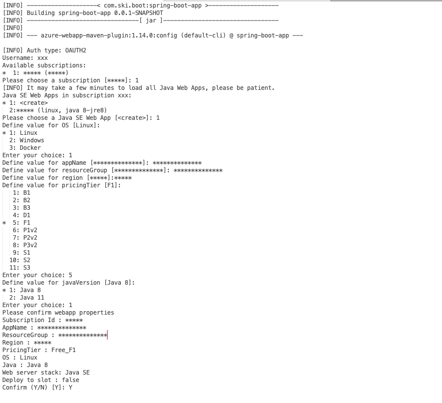
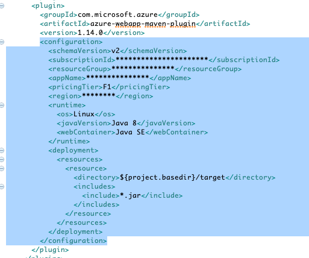
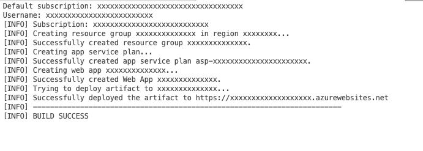

## DEPLOYING SPRING BOOT APPLICATION ON AZURE
	

In this demonstration we will see how to host of a spring boot application on Azure cloud

#### Prerequisites :

Active Azure subscription
 
JDK 1.8 or above
 
GIT bash or any git client
 
Maven
 
Azure CLI
 

  

<h2 font-size:16pt;>Installing Azure CLI and login to azure subscription from terminal : </h2>

$ brew install azure-cli 
  If successfully logged in then check the version   
$ az --version
Use the below command to login   
$ az login
  You will be redirected to browser for login to your Azure subscription. 

   

<h2 font-size:16pt;>Cloning the project from GIT hub and running it : </h2>

$ git clone https://github.com/sunil-mohanty/azure-spring-boot-app.git
  
$ cd azure-spring-boot-app
  
Compile  and build the code -
  
$ ./mvnw clean package
  Run the code -   
$ ./mvnw spring-boot:run

  Now we can validate by hitting the below url in the browser -   
http://localhost:8080/fruits/price-list
  Response will be as follows -   
["1 kg  Golden Apple $5.0","1 kg  Red Guava $3.0","1 kg  Green Orange $1.0","1 kg  Purple Mango $2.0","1 kg  Pink Grapes $4.0"]

   

<h2 font-size:16pt;>Deploying the application in Azure using azure CLI : </h2>

Hit the below command to configure the azure-maven-plugin in the application  
$ ./mvnw com.microsoft.azure:azure-webapp-maven-plugin:1.14.0:config
  
The above command will use your cli authentication token if you have already logged in, Unless it will prompt you for login.
 
Then it will prompt you certain deployment specific questions.
 
The terminal traces will be as follows :
 

Now open and check the configuration section of the pom.xml. You can see the modification as follows :
  

Now run the below maven command to deploy the application on Azure
  
$ mvn azure-webapp:deploy
  
Once deployment is success you can see the below logs in the terminal. 
  
 

Now copy the application url from the terminal and use it as your application url in the browser.
   
Use the context root and end point with the url to get the output : 
  
https://xxxxxxxxxxxxxxxxxxxxx.azurewebsites.net/fruits/price-list
  
Response will be as follows :
 
["1 kg  Golden Apple $5.0","1 kg  Red Guava $3.0","1 kg  Green Orange $1.0","1 kg  Purple Mango $2.0","1 kg  Pink Grapes $4.0"]

  
This application can be managed now by logging in to azure portal.
  

## References :

Find the below reference links for more information :
- [Maven Plugin for Azure App Service ](https://github.com/microsoft/azure-maven-plugins/blob/develop/azure-webapp-maven-plugin/README.md/)
- [Azure spring cloud ](https://azure.microsoft.com/en-us/services/spring-cloud/#overview)
- [Spring Boot App development](https://spring.io/projects/spring-boot)
